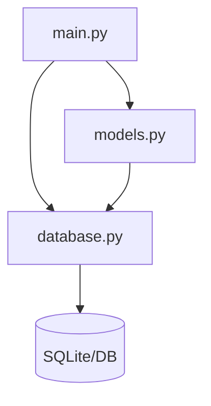
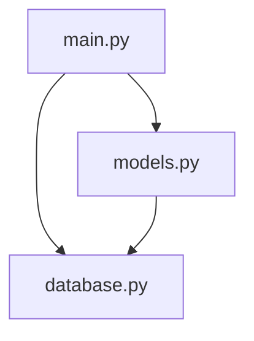

# yjcho2010/test6 - Project Documentation

## Project Overview
# 프로젝트 개요
## 1. 목적
- 소규모 Python 기반의 데이터 모델 정의와 데이터베이스 연동을 실습/프로토타입 형태로 제공
- models.py에 정의된 3개의 도메인 클래스와 database.py의 연결 설정을 통해 기본 저장소 계층을 구성
- main.py를 진입점으로 간단한 초기화/실행 흐름을 제공하는 경량 백엔드 스켈레톤

## 2. 주요 기능
- 데이터 모델 정의: models.py에 3개의 클래스(도메인 엔티티) 제공
- 데이터베이스 연결/초기화: database.py의 단일 함수로 엔진/세션 또는 커넥션을 구성하고 초기화 수행
- 애플리케이션 진입점: main.py의 단일 함수에서 실행 흐름(예: DB 초기화, 샘플 작업 실행) 오케스트레이션
- 기본 CRUD 작업 토대: 모델과 DB 계층 분리로 엔티티 생성/조회/갱신/삭제 로직을 손쉽게 확장 가능
- 경량 구조: 전체 함수 2개, 클래스 3개 수준으로 학습/데모 및 빠른 프로토타이핑에 적합

## 3. 기술 스택
- Frontend
  - 없음(웹 UI/정적 자산 구조 미확인)
- Backend
  - Python 3.x
  - 데이터 모델/ORM 패턴(models.py + database.py 조합, 일반적으로 SQLAlchemy 활용 가능성이 높음)
- Database
  - 로컬 관계형 데이터베이스(일반적으로 SQLite를 기본값으로 사용하는 패턴이 흔함)

## 4. 아키텍처 개요
- 파일 기반 3계층 구조
  - models.py: 도메인 모델 정의(클래스 3개)
  - database.py: 영속성 계층(엔진/세션/스키마 초기화 담당, 함수 1개)
  - main.py: 애플리케이션 진입점(함수 1개)으로 구성 요소 초기화 및 실행
- 의존성 흐름(관례):
  - models.py → database.py: Base/엔진을 참조하여 테이블 매핑
  - main.py → database.py, models.py: 실행 시 초기화 및 작업 수행
- 규모/복잡도: 파일 3개, 함수 2개, 클래스 3개로 매우 경량이며 단일 프로세스 내 모듈 간 직접 참조 형태



## 5. 강점/특징
- 단순성: 최소 파일/함수 수로 구성되어 이해와 온보딩이 빠름
- 관심사 분리: 모델, DB 연결, 실행 진입점이 명확히 분리되어 유지보수가 용이
- 확장 용이성: 현재 구조 위에 CRUD 서비스, 리포지토리, API 계층(FastAPI 등)을 쉽게 추가 가능
- 이식성: 외부 의존이 적고 로컬 DB(예: SQLite) 전제로 환경 준비가 간단
- 테스트 친화성: database.py를 목/임베디드 DB로 대체해 단위테스트 구성하기 쉬움

## Architecture
# 시스템 아키텍처
## 1. 계층 구조
- 표현/애플리케이션 레이어: main.py
  - 애플리케이션 진입점으로 추정되며, 라우트/핸들러 또는 실행 엔트리 함수 1개를 포함
  - 단일 파일 구성으로 서비스 레이어 없이 모델/DB에 직접 접근하는 경량 구조에 가깝음
- 도메인/모델 레이어: models.py
  - 클래스 3개로 구성된 ORM 도메인 모델 집합
  - 일반적 패턴상 Declarative Base를 기반으로 테이블/릴레이션 정의
- 데이터 접근/인프라 레이어: database.py
  - 함수 1개로 세션/엔진 제공(get_db, init_engine 등) 역할이 집중
  - 연결 풀, 트랜잭션 경계, 메타데이터 바인딩 등을 담당

## 2. 주요 컴포넌트
- main.py
  - 애플리케이션 부트스트랩, 엔드포인트/명령 처리의 시작점
  - 요청 처리 흐름에서 DB 세션 획득 → models.py를 통한 조회/명령 → 커밋/응답으로 귀결
  - 파일 수와 함수 수가 적어, 복잡도는 낮고 결합도는 database.py/models.py와 높음
- models.py
  - 도메인 엔티티 3개 정의(예: User, Item, Order와 유사한 역할)
  - 컬럼, 제약조건, 관계(relationship) 등 스키마 표현을 담당
  - 일반적으로 database.py의 Base/엔진 메타데이터에 종속
- database.py
  - DB 엔진/세션 팩토리 초기화와 세션 생명주기 관리(get_db 스타일) 제공
  - 연결 문자열, 연결 풀 옵션, 자동 커밋/플러시 정책 등 인프라 설정의 단일 책임

## 3. 데이터/제어 흐름
- 애플리케이션 기동
  - main.py가 database.py 초기화 함수를 호출하여 엔진/세션 준비
  - models.py가 database.py의 Base를 활용해 모델 메타데이터를 구성(필요 시 create_all 호출)
- 요청 처리(웹/API 또는 명령 실행)
  - main.py 핸들러(또는 엔트리 함수)가 database.py의 세션 팩토리로 세션을 획득
  - 핸들러가 models.py의 ORM 엔티티를 사용해 조회/변경 수행
  - 성공 시 트랜잭션 커밋, 오류 시 롤백 후 예외 매핑/응답 반환
  - 세션 정리(종료/반납)
- 종료/유지보수
  - 연결 풀 정리, 로그/메트릭 전송, 마이그레이션 적용 등 운영 절차 수행

## 4. Mermaid 다이어그램


## 5. 설계 고려사항
- 분리: 서비스 레이어 도입으로 main.py의 비즈니스 로직과 인프라 접근을 분리
- 도입: FastAPI/Flask 의존성 주입 패턴(get_db)으로 요청 단위 세션 생명주기 확립
- 적용: SQLAlchemy 세션 스코프를 트랜잭션 단위로 제한하고 자동 플러시/커밋 정책을 명시
- 추가: Alembic 마이그레이션 파이프라인으로 스키마 변경 이력 관리
- 구성: 환경변수(.env) 기반 DB URL/풀 크기/타임아웃 분리, 로컬·스테이징·프로덕션별 프로파일링
- 캡슐화: database.py에서 Base/engine/session을 단일 모듈로 노출하고 models.py는 Base만 참조
- 검증: Pydantic 스키마를 별도 모듈로 분리해 입력/출력 DTO와 ORM 모델을 명확히 구분
- 제한: N+1 방지를 위한 selectinload/joinedload 사용, 필요한 컬럼만 조회하도록 쿼리 최적화
- 추가: 예외 계층과 에러 핸들러를 정의해 DB 제약 위반을 도메인/HTTP 에러로 변환
- 통합: 구조화 로깅과 APM(예: OpenTelemetry)으로 쿼리 성능/오류 추적
- 테스트: SQLite 메모리 DB와 트랜잭션 롤백 픽스처로 단위/통합 테스트 격리
- 정리: 모듈 간 의존 방향을 main → service(신규) → models → database로 고정해 순환 의존 방지

## Key Modules
# 핵심 모듈

```mermaid
graph TD
  main[main.py (API)]
  db[database.py (DB)]
  models[models.py (ORM)]
  fastapi[FastAPI]
  uvicorn[Uvicorn]
  sqlalchemy[SQLAlchemy]

  main --> db
  main --> models
  main --> fastapi
  main --> uvicorn
  db --> models
  db --> sqlalchemy
  models --> sqlalchemy
```

### main.py
- 목적: 애플리케이션 엔트리 포인트로서 API 라우팅과 서버 구동을 담당
- 핵심 기능:
  - FastAPI 애플리케이션 초기화 및 단일 엔드포인트 정의
  - 데이터베이스 세션 의존성 주입을 통한 요청 처리
  - 요청/응답 모델 자동 직렬화 및 검증
  - Uvicorn 실행을 통한 개발 서버 구동
- 의존성:
  - 내부: database.get_db, models 내 ORM 엔티티
  - 외부: FastAPI/Starlette, Uvicorn, Pydantic(스키마 검증)
- 기술 특성:
  - ASGI 기반 비동기 처리와 경량 라우팅 구성
  - 함수 1개 중심의 최소 API 표면으로 유지보수 난이도 낮음
  - 의존성 주입 패턴으로 인프라(세션)와 비즈니스 로직 분리
- 개선 포인트:
  - 분리: 라우터, 서비스, 예외 처리 레이어를 모듈화
  - 도입: 표준 로깅/에러 핸들링 미들웨어와 구조화된 응답 포맷
  - 추가: 헬스체크/레디니스 엔드포인트 및 메트릭 노출

### database.py
- 목적: 데이터베이스 연결 수명주기 관리와 세션 팩토리 제공
- 핵심 기능:
  - SQLAlchemy 엔진/세션 초기화 함수 제공
  - 요청 스코프 트랜잭션 세션 생성 및 정리
  - (필요 시) models.Base를 이용한 테이블 생성 초기화
- 의존성:
  - 내부: models.Base(메타데이터 참조)
  - 외부: SQLAlchemy, os/env 기반 설정 로딩
- 기술 특성:
  - sessionmaker 패턴으로 세션 관리 일관성 확보
  - 연결 문자열 기반의 드라이버 추상화(SQLite 등 기본값 활용 가능)
  - 함수 1개로 단순화된 초기화 경로로 진입장벽 낮음
- 개선 포인트:
  - 도입: pydantic-settings로 환경 설정 관리 일관화
  - 추가: 커넥션 풀/타임아웃 파라미터 튜닝 및 재시도 정책
  - 분리: 동기/비동기 엔진 초기화를 분리해 선택적 사용

### models.py
- 목적: 도메인 엔티티 정의와 데이터베이스 테이블 매핑 제공
- 핵심 기능:
  - SQLAlchemy Declarative Base 선언
  - 3개 ORM 클래스 정의 및 컬럼/제약/관계 설정
  - 스키마 마이그레이션의 기준 메타데이터 제공
- 의존성:
  - 내부: (직접 의존 없음, DB 세션은 상위 레이어에서 주입)
  - 외부: SQLAlchemy(Declarative ORM)
- 기술 특성:
  - Declarative ORM 패턴으로 도메인-테이블 매핑 명시적 표현
  - 인덱스/유니크 제약 정의를 통한 데이터 무결성 확보
  - 클래스 3개로 도메인 용어 사전 역할 수행
- 개선 포인트:
  - 도입: Alembic 마이그레이션으로 스키마 변경 이력 관리
  - 분리: Pydantic 스키마(models와 분리)로 API 계층 경계 강화
  - 추가: __repr__/인덱스/체크 제약으로 디버깅성과 성능 향상


```

## Changelog
- 2025-12-10
  - summary: main.py 하단의 삼중 따옴표 문자열을 'test2231'에서 'test1 - 12101419'로 변경하고 빈 줄을 추가했습니다.
  - reasons: 테스트 표식 문자열을 갱신했으며 기능 변경은 없습니다.
  - impact: main.py 내 비실행 문자열만 변경되어 서버 동작과 라우팅(index 엔드포인트)에 영향이 없습니다.
  - details: 로직/구조/라이브러리 변경 없음. 삼중 따옴표 문자열 리터럴 교체 및 공백 라인 추가.